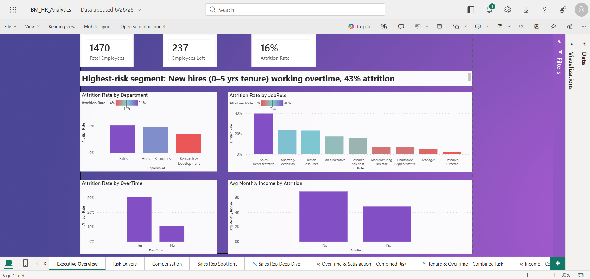
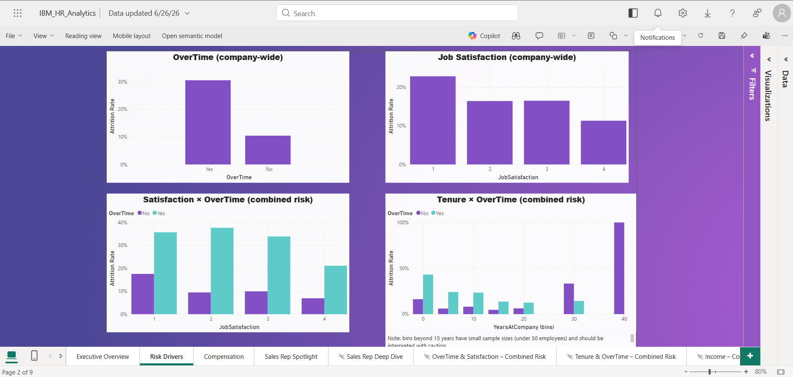
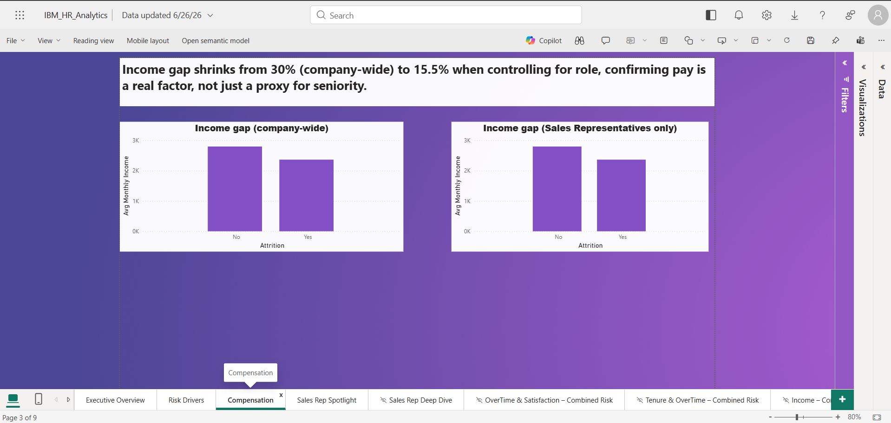
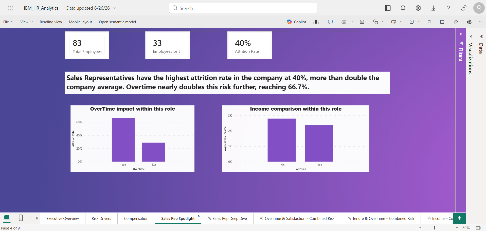

# Employee Attrition Dashboard (Power BI)

This project investigates whether employee attrition at a company is a broad problem or something concentrated in specific groups, since the answer changes what a company should actually do about it. It uses the IBM HR Analytics dataset of 1,470 employees, and the analysis was built in Power BI.

A company treating attrition as a general problem will respond very differently to one that knows exactly where it is concentrated. This project follows the evidence to find out which one is actually true here.

An interactive Power BI file is included in this repo.

## Executive Summary

Below is the Executive Overview page from the dashboard, and each finding is explored in more detail underneath.

## Where Attrition Is Concentrated

Looking at department alone, Sales sits at 21%, HR at 19%, and R&D at 14%. That already points to Sales as the area of concern, but department is a broad grouping. Breaking it down by job role tells a sharper story: Sales Representative on its own sits at 40%, nearly double what the department figure suggested. The department number was hiding how bad it actually was for this one role.

## Risk Drivers: Overtime, Satisfaction, and Tenure

Overtime is the strongest driver of attrition in this dataset. Company wide, employees working overtime have a 31% attrition rate, compared to 10% for those who do not, roughly three times higher. Within Sales Representatives specifically, the gap is even sharper: 66.7% for those working overtime against 28.8% for those who are not.

Job satisfaction matters, but overtime overrides it. Attrition drops from 23% at the lowest satisfaction level down to 11% at the highest, which follows the pattern you would expect. But once overtime is factored in, even the most satisfied employees working overtime show a 21% attrition rate, higher than dissatisfied employees who are not working overtime (18%). Overtime turns out to be the stronger factor by a clear margin.

New employees working overtime are the highest risk group in the company. Employees with 5 years or less at the company who are also working overtime show a 43% attrition rate, the highest figure found across the whole analysis. Right now, 231 current employees fall into exactly this profile. That is not a historical number, it is a live headcount of people currently sitting in the riskiest segment identified. Bins beyond 15 years of tenure had very small sample sizes and were left out of this comparison for that reason.

## Compensation

A real pay gap exists between employees who left and those who stayed, even within the same role. Company wide, employees who left earned about 30% less on average than those who stayed. That gap could partly be explained by junior roles simply paying less and turning over more for unrelated reasons, so this was checked again using only Sales Representatives, where everyone holds the same job title. The gap was still there, just smaller, at 15.5%, which suggests pay itself is a real factor, not just a byproduct of job level.

## Sales Rep Spotlight

Since Sales Representative came out as the highest risk role across almost every part of this analysis, it gets its own page pulling those numbers together in one place: 40% attrition overall, 66.7% when overtime is involved, and a 15.5% pay gap between those who left and those who stayed within the role.

## Recommendations

- **Review staffing and overtime distribution within the Sales Representative role first.** This single role accounts for the highest attrition in the company, and overtime is the strongest factor tied to it.
- **Focus retention efforts on the first 5 years of employment, specifically where overtime is involved.** This is the highest risk window identified, and 231 current employees fall directly into this group today.
- **Investigate compensation for Sales Representatives specifically**, since a real pay gap exists even when comparing people doing the exact same job.
- **Treat satisfaction as a secondary indicator, not the primary lever.** It correlates with attrition, but overtime has a stronger and more consistent effect across every group tested.

## What This Cannot Tell You

This dataset is a single snapshot with no date fields, so it cannot show whether attrition is rising or falling over time, only how things look right now.

The relationships found here are correlations, not proven causes. Overtime, satisfaction, and pay are all linked to attrition, but this data cannot fully separate which factor is the root cause versus a symptom of another. For example, it is possible that employees already planning to leave avoid overtime, rather than overtime pushing them to leave.

Some groups in the data were too small to draw conclusions from reliably, such as employees with more than 15 years at the company (in some cases fewer than 10 people), and were left out of the findings for that reason.

The cost of attrition figure is an estimate based on a standard replacement cost multiplier (1.5 times monthly income), not an actual company reported cost.

## Tools Used

Power BI Desktop, using Power Query for data preparation and DAX for the measures (CALCULATE, DIVIDE, AVERAGE).

## Files in This Repo

